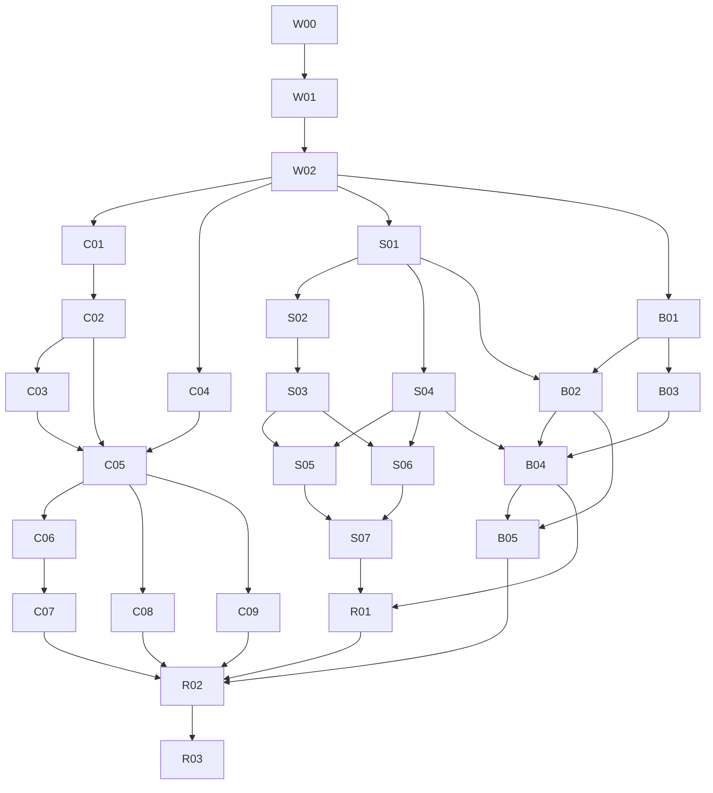

# Phased implementation plan

Status: user-approved execution plan, 8 September 2026; local implementation is in progress and bounded local source/test deliveries have been accepted. The [execution ledger](execution-status.md) is authoritative for current assignments, exact commits, validation and originating-root acceptance. Package scope and exit gates below remain binding; effort ranges are planning estimates to refine through inventory and measurement, not delivery commitments or claims that a whole phase is complete.

## Execution model and review ownership

Use native collaboration agents, each assigned one bounded artifact/PR with explicit owned paths, requirements, dependency versions and evidence. The user authorized simpler models: `gpt-5.6-luna` for inventories, fixture/reference checks and narrow documentation; `gpt-5.6-terra` for moderate adapters/UI and test implementation; `gpt-5.6-sol` for cross-component implementation. The lead agent and originating reviewer retain transaction/security, canonical-chain, storage-commit and architecture integration decisions. An author does not approve its own trust-boundary work. No installed “Subagent Driven Development” skill was found or loaded.

Each agent returns: changed paths and exact base/head, implemented behavior and requirement IDs, test commands/results, remaining risks, and whether it is working, complete or blocked. Monitor every delegated task to a terminal state. Do not describe pending CI as successful. Rebase overlapping interface work before integration, and rerun the consumer contract affected by that rebase. Prefer separate worktrees once an implementation repository has a valid HEAD; the planning project's unborn HEAD is unrelated setup and must not trigger source commits.

Each numbered package is a reviewable PR-sized scope. Split a package further if its estimated upper bound or trust boundary cannot be reviewed coherently. Estimates are engineer-days of authoring and focused tests on a known baseline; integration/CI/review and unknown Go adapter discovery are additional. Do not add them together as a calendar promise.

## Phase 0 — establish executable contracts

| Package | Change and likely ownership | Depends | Proposed author / size | Exit evidence |
| --- | --- | --- | --- | --- |
| W00 Baseline and boundaries | Record exact TS/Go source versions; locate maintained Go client resolver/identity code and deployed engine-storage ownership; inventory UI topic rows, wallet transports/permission wrappers, policy defaults and current tests. No assumption that local Go copies are deployed. | Documentation review | Luna inventory + lead decision; 1–2 days | Owned-path map, compatibility matrix, known unknowns resolved or explicitly scoped, clean/preserved source status. |
| W01 Shared fixtures and measurement harness | Synthetic lookup hosts/trackers, canonical/reorg header fixtures, same-tx multi-output BEEF, alternate proofs, malicious evidence, delay/never-finish peers, current BRC-136 vectors and deterministic storage failure points. Add cold/warm benchmark protocol without claiming speed improvements. | W00 | Terra; 2–3 days | Baseline reproduces fixed discovery and identity transaction gap; reference data checked independently; [verification plan](verification-plan.md) cohorts runnable. |
| W02 Public and persistence contracts | Finalize additive verified-session/wallet capabilities, error/progress outcomes, policy/cache contexts, storage commit/index publication/ack semantics, GASP/BASM cursor/version contracts and topic status schema. Shared conformance schema and migration versioning belong with governed specs. | W00, W01 | Sol + lead security reviewer; 2–4 days | API review preserves legacy Promise/wire/defaults; finite resource defaults selected from corpus before any feature activation; fixtures pin semantics. |

W00 must specifically reconcile `seekPermission` default documentation versus implementation and the current toolbox pagination forwarding gap using compatibility fixtures. Preserve established behavior unless a separately reviewed correction/migration is accepted. Neither item reopens the product decision to support progressive identity lookup.

## Phase 1 — secure and progressively expose the client path

| Package | Change and likely files/packages | Depends | Proposed author / size | Exit evidence |
| --- | --- | --- | --- | --- |
| C01 Secure existing identity result intake | `identityUtils.ts`, wallet services and related SDK verifier adapter: derive txid from bytes, require transaction/SPV success before identity parsing, require certificate success, retain certifier and local-contact behavior. Start with correct bounded verification; don't wait for performance work. | W01, W02 | Sol with lead security review; 2–3 days | Old path fails forged/unanchored fixture and new path rejects it; valid certs still pass; invalid signature throws remain rejected; no raw/alternate entry path bypass. |
| C02 Shared verification coordinator | SDK generic evidence coordinator: immutable byte binding, txid jobs including in-flight work, alternate-proof retry, output/context validation contracts and bounded cache. Shared ancestors when context-valid. | C01, W02 | Sol; 3–4 days | One transaction job for concurrent multi-output/repeated host evidence; bad-first/good-later succeeds; wrong hint never poisons cache; race/cancel tests. |
| C03 Chain-aware cache lifecycle | ChainTracker context/invalidation adapter; inspect `ChaintracksChainTracker`, local ChainTracks and all integration caches; positive-proof dependencies, reorg and trust-policy invalidation, result-cache protection. | C02 | Sol + lead chain review; 2–4 days | Deep/shallow reorg and stale in-flight verdict tests; network/policy isolation; adapters without epoch events revalidate dependencies. |
| C04 Dynamic discovery and bounded host scheduler | `LookupResolver.ts` and helpers: active subscription to late tracker replies/refresh, bounded fair host queue, abort/ownership, byte-safe body reads, honest settlement/backoff accounting; preserve raw/final/freeform APIs. | W02 (C02 interface usable) | Terra; 2–4 days | Later tracker-only host contributes during active query; one hanging peer doesn't hold useful delivery or completion forever; old APIs conform; CORS unchanged. |
| C05 Verified generic progressive API | Connect discovery, intake and verification to deltas/progress/final summary; cumulative compatibility adapter; backpressure, slow subscriber resync, cancellation/fatal cleanup. Include a non-identity consumer example. | C02, C03, C04 | Terra + Sol integration review; 2–3 days | End-to-end generic tests, empty/failure/freeform distinction, no unverified useful event, exact once terminal and late-result isolation. |
| C06 Wallet/identity progressive capability | Add optional methods/capability negotiation through wallet, `WalletPermissionsManager`, `IdentityClient`, browser/mobile boundaries; preserve Promise result objects, limit/offset and originator/trust behavior. Capability-aware fallback explicitly final-only. | C01, C05 | Sol; 3–4 days | Permission/trust tests, packed declaration compatibility, remote old-wallet fallback, progressive capable wallet and final method share validation. |
| C07 Identity UI integration | Locate actual identity consumer in W00; render verified additions, typeahead supersession, stable selection, honest empty/availability states, progress and invalidation. Keep identity semantics outside generic resolver. | C06 | Terra; 1–3 days | Browser UX recording with delayed later tracker, forged first host, typeahead/reorg; useful result appears before slow hosts finish. |
| C08 Verifast/worker tuning | Reuse existing BDK/WASM worker/batch paths; off-thread parse/verification where appropriate, fairness, budget enforcement and cold/warm lifecycle. Tune using target workload. | C02, C03, C05; C07 for UX validation | Terra implementation + Sol security review; 2–3 days | JS/WASM verdict parity, verified-work reduction, p50/p95 and peak-memory report, mobile/worker-less behavior; no security downgrade or mandatory cross-origin isolation. |
| C09 Go generic/client parity | Implement language-appropriate progressive/cancellation and shared-verification semantics in the maintained Go client package located in W00. Keep equivalent wire behavior, not identical TS API spelling. Identity glue only where that client exposes identity. | W02, C05 reference semantics | Terra + Sol interop review; 2–4 days after inventory | Go-client/TS-server and Go-client/Go-server conformance; cancelled contexts, same-tx dedup and alternate-proof success. |

C01 should ship as a reviewed security correction without waiting for Mongo or BASM. A rollout toggle must not restore acceptance of unverified overlay identities. C04 can be authored alongside C02/C03 against W02 fixtures. C07 is a required deliverable: an unused iterator does not meet the UX requirement.

## Phase 2 — durable Mongo-only overlay runtime

| Package | Change and likely files/packages | Depends | Proposed author / size | Exit evidence |
| --- | --- | --- | --- | --- |
| S01 Storage capability and reference contract | TS `Storage.ts`, Go `engine.Storage` additive capabilities and adapter harness; versioned schemas, idempotency, acknowledge/index states, fenced generation, payload references and outbox events. Preserve legacy adapters via explicit capabilities. | W02 | Sol + lead commit review; 2–3 days | Contract suite runs against reference/fake and existing adapters; unsupported guarantees cannot be advertised. |
| S02 Mongo payload/schema foundation | TS Mongo adapter collections/indexes/migration ledger, shared per-tx/proof/BEEF graph references, GridFS publication/pins/GC, driver transaction retry/outcome helpers. | S01 | Terra + lead race review; 3–4 days | 16 MiB boundary/oversized individual-tx cases, staged-upload crashes/GC race, unknown commit and duplicate identity tests. |
| S03 TS atomic admission and index publication | Engine submit/replay integration, enlisted Mongo indexes or explicit projection outbox, acknowledgment/read-your-write semantics, spent/admission/history updates and propagation outbox. Retain SQL compatibility behavior explicitly. | S02 | Sol; 3–4 days | Crash and competing-spend matrix; no lost acknowledged writes, no invisible claimed index commit; duplicate delivery safe or gated by capability. |
| S04 Go Mongo engine adapter and admission integration | Maintained Go engine adapter and submit/commit/propagation paths; equivalent schema semantics and outboxes. Preserve injectable Go storage default behavior. | S01; S02/S03 fixtures | Terra adapter + Sol commit review; 3–4 days | Same storage fault suite, durable STEAK and restart replay, version/namespace compatibility; no implicit mixed-language concurrent DB writers. |
| S05 Discovery/projection consistency | TS/Go SHIP/SLAP unique outpoint/index migration, replay-safe writes, deterministic order, serving-ban/eviction behavior separate from historical admissions. External plugin adapter/rebuild/checkpoint contract. | S03, S04 | Terra; 2–3 days | Existing duplicate-data migration rehearsal, ban/write race, no historical BASM loss from moderation, projection backlog/readiness and resync tests. |
| S06 GASP cursor/restart contract | TS/Go durable graph finalization/cursors, equal-score safe legacy compatibility or negotiated extension, checkpoint atomicity and peer-error isolation. | S03, S04, W02 | Sol; 2–4 days | Page boundary equal-score, crash-after-admit-before-cursor, malformed peer isolation, old/new mixed wire tests. |
| S07 Mongo-only runtime selection/readiness | `OverlayExpress.ts`, `infra/overlay-server`, Go host/factory startup: chosen overlay backend, schema readiness and workers, Mongo profile env/container docs. Remove unconditional overlay Knex checks only for Mongo profile; retain wallet provider abstraction. | S03–S06 | Terra; 2–3 days | Boot/submit/lookup/restart with overlay SQL absent; existing SQL profile works; healthy process + failed Mongo means not ready; wallet configuration still abstracted. |

The schema is proposed portable logical storage, not authorization for mixed-version TS/Go instances to share one writable node database. Enable that topology only through a separately tested schema/version/fencing contract; ordinary interoperability is between nodes over public protocols.

## Phase 3 — complete BASM and operator evidence

| Package | Change and likely files/packages | Depends | Proposed author / size | Exit evidence |
| --- | --- | --- | --- | --- |
| B01 BASM conformance and wire bounds | Current BRC-136 fixtures, TS endpoint/client range continuity and proof validation hardening, version/capability fallback rules; distinguish confirmed defects from audits in PR description. | W01, W02 | Terra + lead protocol review; 2–3 days | Independent current-root/TAC vectors; canonical hash/position/txid validation; range/gap/equivocation/legacy tests. |
| B02 Durable TS recovery jobs | `Engine.ts`, BASM helpers/remote and storage capabilities: common-height comparison, bounded TAC localization, remote/local-extra repair classification, target coverage, durable staging/cursor/fencing and resume. Include SQL adapter progress support without requiring Mongo activation. | B01, S01 (storage implementations before end-to-end merge) | Sol + lead architecture review; 3–4 days | Equal-height/local-ahead repair, no deletion to match incomplete peer, bounded unresolved conflict, >one-page catch-up and restart/reorg proof. |
| B03 Go BASM primitives/endpoints | Go engine/storage/HTTP BASM support from current vectors; public endpoints preserve cross-domain access and existing caller injection. | B01, S01 | Terra; 2–3 days | TS-generated vectors independently checked by Go and vice versa; six messages old/new interop and unsupported signaling. |
| B04 Go recovery and durable scheduling | Port semantic job state, fenced progress and validated repair into Go; TS/Go schedules isolate peers/topics, resume with leases/backoff, use shutdown/boot recovery. | B02, B03, S04 | Sol; 3–4 days | TS-client/Go-server BASM recovery plus reverse direction, scheduling/error/reorg/lease-expiry tests. |
| B05 Topic status service and frontend | Durable status projection, per-peer aggregation/precedence, public/admin redaction, existing health integration and topic-row badge/diagnostic drilldown in TS and Go frontend hosting paths. | B02, B04; S07 for final runtime integration | Terra + lead evidence review; 2–3 days | Fresh match cannot hide divergence/storage failure; old prefix/stale/reorg/unsupported cases; visible per-topic status with accessible labels. |

B01/B03 can run alongside the storage/client lanes. B02 can begin using a durable SQL test adapter while Mongo work continues; B04 and final status acceptance require their durable adapters. BASM code presence is not enablement: keep automatic sync defaults unchanged until explicit rollout selection with migration/readiness evidence. GASP stays enabled/configured independently.

## Phase 4 — migration rehearsal, integration and controlled release

| Package | Change | Depends | Proposed author / size | Exit evidence |
| --- | --- | --- | --- | --- |
| R01 Migration tooling and dry run | Export/import manifests, checksums, unknown-record handling, data/proof/anchor retention, quiescent cutoff and all-post-cutover-write reverse replay or forward-fix procedure. Operator tooling defaults to dry run. | S05–S07, B02–B04 schema stable | Terra + lead recovery review; 3–4 days | Synthetic production-shaped migration, cutover and rollback rehearsal; every acknowledged write preserved at final fenced cutoff; readiness controls rehearsed. |
| R02 Cross-stack failure campaign | Execute [verification plan](verification-plan.md) for all language/backend profiles, Atlas/replica failover, full disk, restart, reorg, large payloads and topic badge truthfulness. | C07–C09, S07, B05, R01 | Terra tests + Luna independent evidence check; 2–4 days plus campaign time | Traceability ledger has reproducible artifacts; no unresolved invariant failure, unsupported claims or missing required profile. |
| R03 Release and operational documentation | Package/dependent SemVer and root release notes, config/schema migrations, operator runbooks, rollback limits, public API examples and deployable health contracts. | R02 | Luna docs + lead integration review; 1–2 days | Governed repository checks, exact-head complete CI and reviewer approval; explicit source/activation/deployment distinction. |

The user has authorized local source implementation and testing under this plan. Package publication, deployment, live database migration and feature activation remain separate gates and are not authorized. A later operator-controlled rollout should select a synthetic/staging environment, then opt-in canaries, then expand only with accepted evidence; it must not quietly switch public defaults.

## Dependency and parallel lanes

Tables carry the full dependencies where the graph omits fixture/implementation edges for readability. The client lane can improve security/UX without waiting for server migrations. Storage and BASM agree on W02/S01 before separate implementations, preventing divergent cursor/anchor schemas. Parent review should integrate each completed lane against requirements, then run the combined failure campaign before deployment proposals.

## Review gates

| Gate | Parent/lead decision and evidence |
| --- | --- |
| G0 Design | Confirm scope/exclusions, stable wallet API, ordinary BRC-136 roots, truthful completeness, and requirement traceability. Resolve engineering defaults by source/measurement, not repeated product questions. |
| G1 Trust boundary | Independently inspect byte→txid binding, proof candidates/shared jobs, explicit transaction/certificate success, per-output trust, canonical cache lifecycle and worker verdict binding. Negative fixtures must fail on the old behavior where applicable. |
| G2 Durability | Inspect transaction retry vs ambiguous-commit reconciliation, durable ack/index publication, staged payload/GC race, outbox idempotency, cursor/epoch fencing and all-write rollback. Failure tests demonstrate invariants, not only happy-path CRUD. |
| G3 Protocol/recovery | Verify BRC-136 vectors, common-height/target distinction, canonical proof positions, local-superset handling, legacy capability negotiation, GASP no-skip pages and honest per-topic aggregation. |
| G4 Consumer/operations | Validate actual identity UX, permission/pagination/contact compatibility, browser/mobile/Go profiles, public/admin data split, SQL-free overlay startup and SQL compatibility; benchmark current workload. |
| G5 Repository/release | Apply authoritative repo governance to exact PR head: root health/lint/format/typecheck/security audit plus affected tests/build/coverage/conformance/packed/browser/mobile/infrastructure checks. Resolve all review threads/new findings; report only commands actually run. |
| G6 Activation proposal | Review dry-run migration and rollback evidence, immutable reviewed artifact/config, supported schema versions, monitoring and explicit operator activation/cutover plan. No green badge solely from enabled configuration. |

Rollback may disable progressive presentation or optional WASM acceleration while retaining independent verification. It must not reintroduce the insecure identity path. Storage rollback requires the fenced all-acknowledged-write rule in [Mongo storage](mongo-storage.md). BASM rollback can pause jobs and invalidate positive status while retaining historical data and recovery records; old code must refuse incompatible schema rather than misread it.
